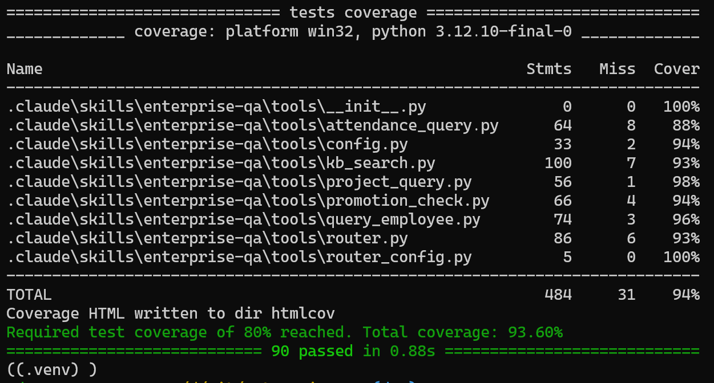

# Enterprise QA System

<p align="center">
  <a href="README.md">English</a> |
  <a href="README.zh.md">简体中文</a>
</p>

## 单元测试覆盖率



测试覆盖率超过 90%。

## 文档

- [需求规格说明书](./srs.md) - 软件需求规格
- [设计文档](./design.md) - 系统设计方案
- [开发规范](./convince.md) - 系统开发规范
- [考试说明](./enterprise-qa-exam.md) - 详细考试要求
- [单元测试报告](htmlcov/index.html) - 运行 build.sh 之后会生成

## 使用说明

### 触发词

使用 `/enterprise-qa` 触发 Skill：

```
/enterprise-qa "张三的部门是什么？"
/enterprise-qa "年假怎么算？"
/enterprise-qa "王五符合晋升条件吗？"
```

### 环境准备

- Python 3.10+
- sqlite3 命令（Windows 用户需自行安装，Linux/Mac 通常自带）

### 安装方式

1. 将 `.claude/skills/enterprise-qa/` 目录放入 Claude Code 项目
2. 使用虚拟环境安装依赖
```
# 创建虚拟环境
python -m venv .venv
# 激活虚拟环境
# Windows:
.venv\Scripts\activate
# Linux/Mac:
source .venv/bin/activate
# 安装依赖
pip install -r requirements.txt
```
3. 配置数据库路径（可选）：
   - 环境变量方式：
     ```bash
     export ENTERPRISE_QA_DB_PATH="./enterprise.db"
     export ENTERPRISE_QA_KB_PATH="./knowledge"
     ```
   - 或复制配置文件：
     ```bash
     cp config.yaml.example config.yaml
     ```

### 运行测试

安装虚拟环境，并`pip install -r requirements-dev.txt`安装依赖

> requirements-dev.txt 引用 requirements.txt 并包含单元测试和代码检查工具

```bash
chmod +x *.sh

# 样式检查
./check.sh

# 单元测试
./build.sh
```

## Release 发布

运行 `./release.sh` 构建可分发包：

```bash
./release.sh
```

输出：
- `dist/enterprise-qa-skill-{version}.zip`
- `dist/enterprise-qa-skill-{version}.tar.gz`

解压 zip 即可安装 Skill。

使用MiniMax M2.7加入Claude Code，功能测试的运行结果[test.txt](./test.txt)

## 项目结构

```
enterprise-qa/
├── .claude/
│   └── skills/
│       └── enterprise-qa/
│           ├── SKILL.md         # Skill 定义
│           ├── tools/          # 工具实现
│           └── tests/          # 单元测试
├── knowledge/                   # 知识库文档
├── enterprise.db                 # SQLite 数据库
├── config.yaml.example          # 配置文件示例
├── requirements.txt             # 依赖清单
├── requirements-dev.txt         # 依赖清单，包含测试，代码检查等工具
```

### 目录结构说明

```
.venv/                      # Python 虚拟环境（自动创建）
htmlcov/                    # 测试覆盖率报告（运行测试后生成）
logs/                       # 日志文件（运行时自动创建）
session.json               # 对话历史（多轮对话时自动创建）
enterprise.db              # SQLite 数据库
config.yaml                # 配置文件（可选，复制自 config.yaml.example）
```

## 交付物清单

| 交付项 | 位置/状态 |
|--------|---------|
| Skill 可在 Claude Code 执行 | `.claude/skills/enterprise-qa/SKILL.md` |
| 测试数据库 enterprise.db | 项目根目录 |
| 知识库 knowledge/ | 项目根目录 |
| Skill 使用说明 | 本文件  |
| 测试用例运行方式 | 本文件 |
| 依赖清单 requirements.txt | 项目根目录 |
| 配置文件说明 | `config.yaml.example` |
```